<!--
 Copyright (c) 2022 Jorge de Jesus Perez Lopez

 This software is released under the MIT License.
 https://opensource.org/licenses/MIT
-->

# Spents Controller

This project was developed following the course React - [React - La Guía Completa: Hooks Context Redux MERN +15 Apps](https://www.udemy.com/course/react-de-principiante-a-experto-creando-mas-de-10-aplicaciones/) taught by Professor [Juan de la Torre](https://codigoconjuan.com/).

The application allows you to control your expenses in a simple way, adding a budget and later adding your expenses. It shows a list with all the expenses made, as well as a graph that shows the total expense. It also allows you to remove an expense from the list. Allows you to filter expenses by category.

# Control de Gastos

Este proyecto fue desarrollado siguiendo el curso de [React - La Guía Completa: Hooks Context Redux MERN +15 Apps](https://www.udemy.com/course/react-de-principiante-a-experto-creando-mas-de-10-aplicaciones/) impartido por el profesor [Juan de la Torre](https://codigoconjuan.com/).

La aplicación permite controlar tus gastos de una manera sencilla, agregando un presupuesto y posteriormente agregando tus gastos. Muestra una lista con todos los gastos realizados, así como una gráfica que muestra el gasto total. También permite eliminar un gasto de la lista. Permite hacer un filtrado de gastos por categoría.

## Installation of dependencies 📦

```cmd
npm install
```

## Run the application in development 🚀

```cmd
npm run dev
```

## Build the app for production 🏗

```cmd
npm run build
```

## Run the application in production 🏗

```cmd
npm run build
```

## App 📱💻

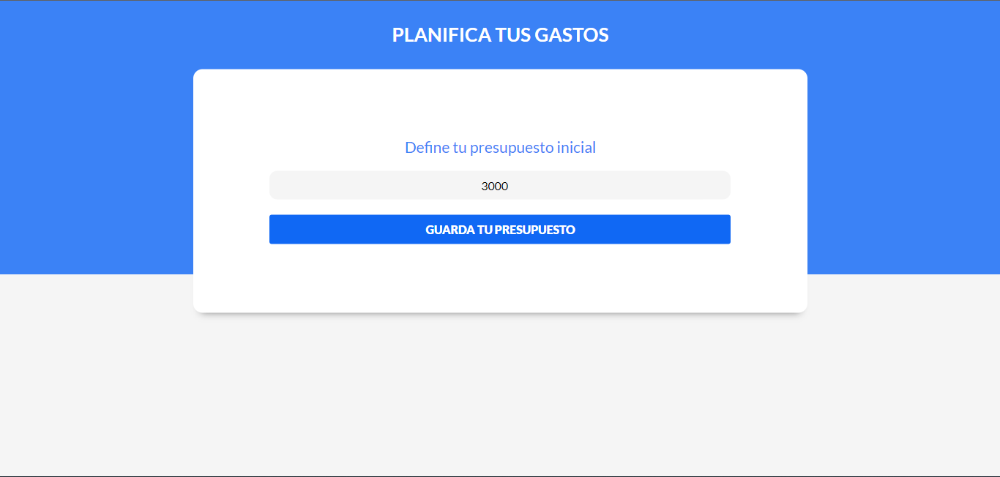
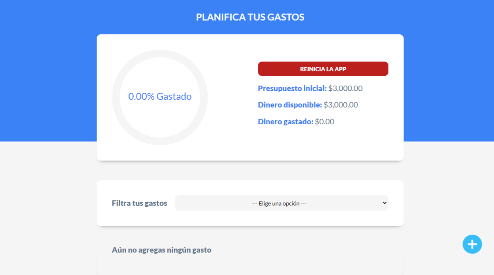
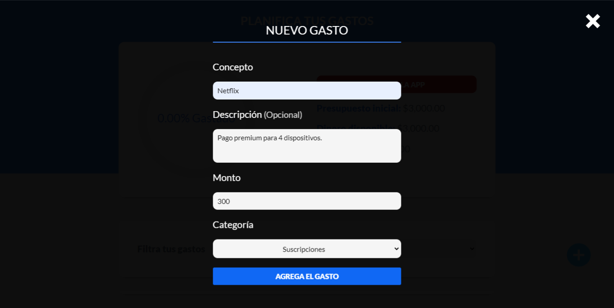
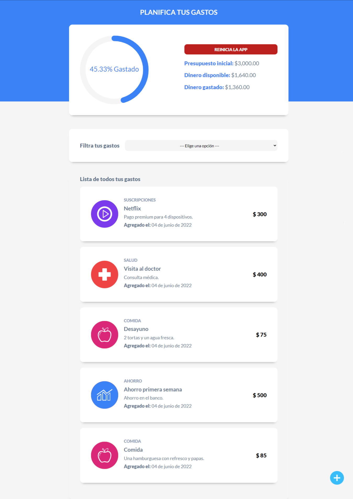
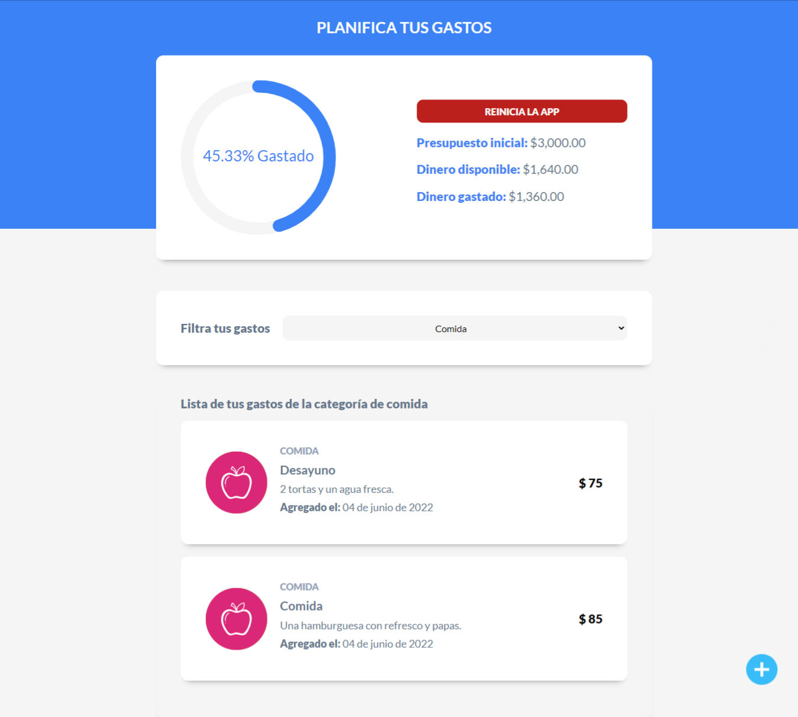
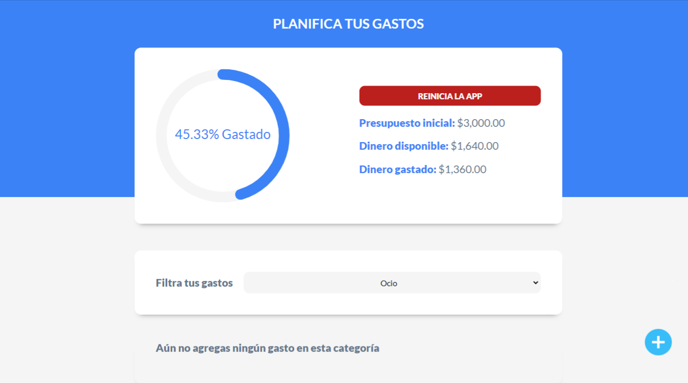
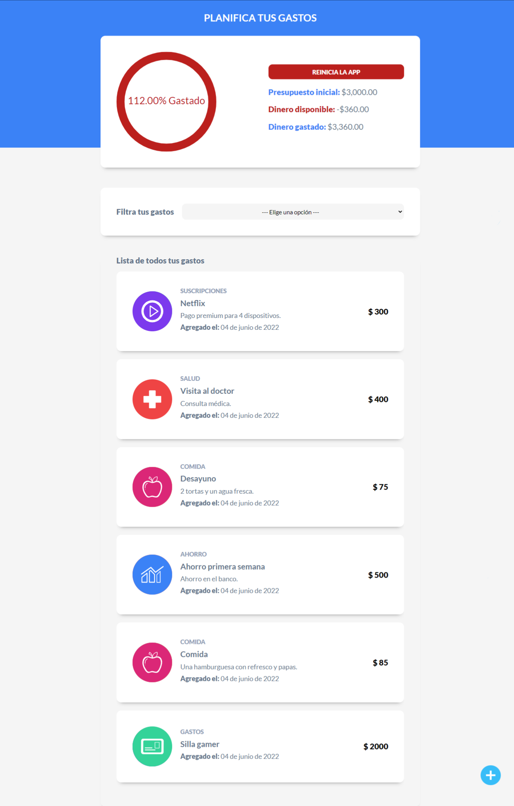
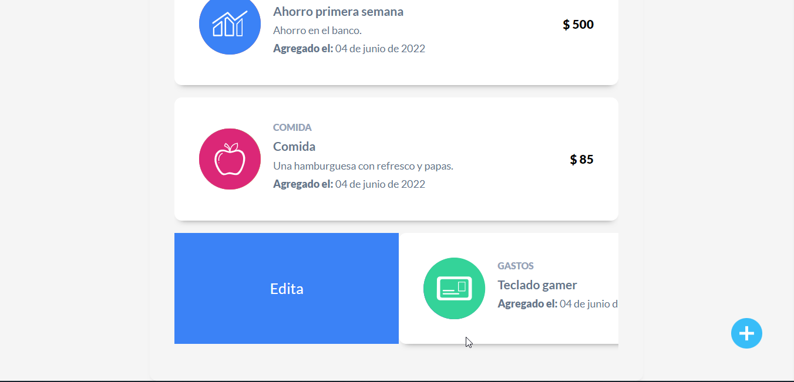
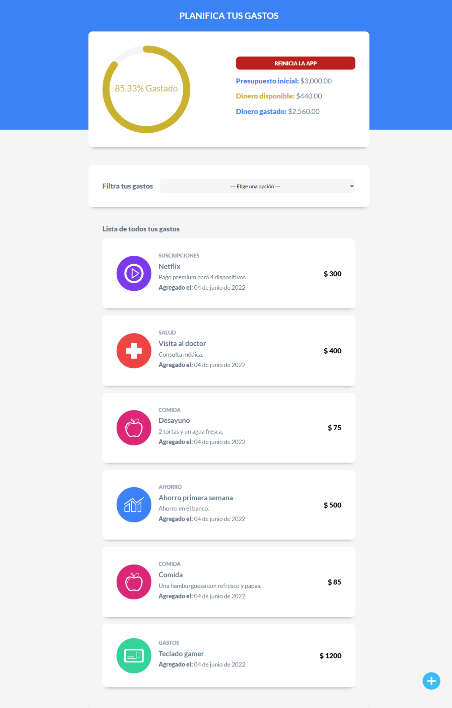
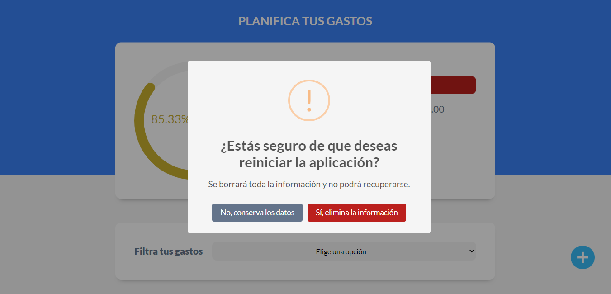
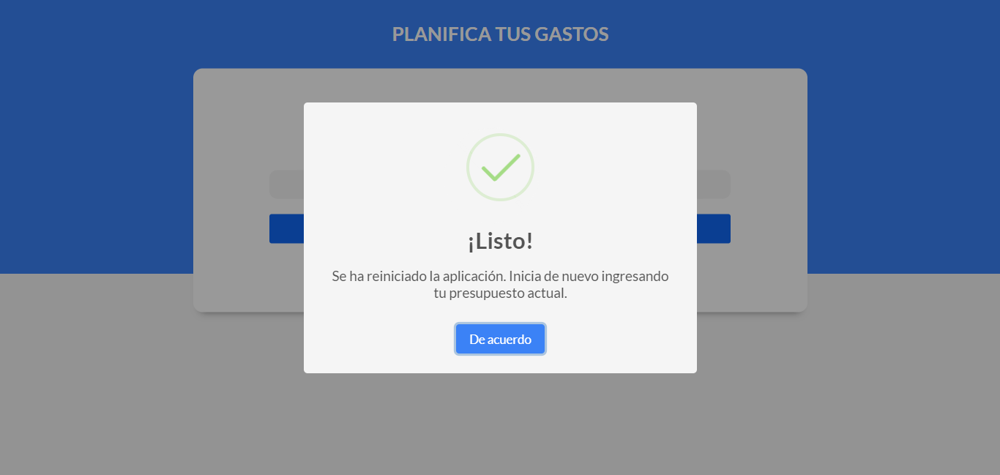
